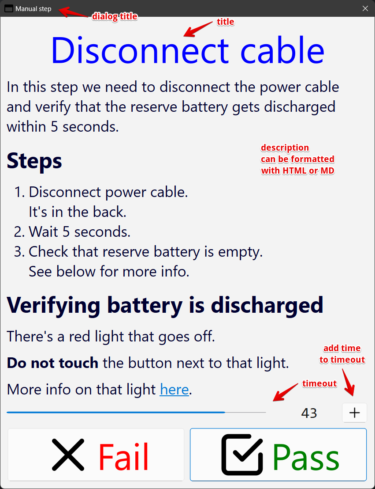

# Show Dialog
Easily show a dialog window for miscellaneous purposes.

The initial use case is to show instructions in manual steps in tests.

See [features](#features) and [example](#example) for quick details.

## Getting started
### Library
```
pip install qt-show-dialog
```

### Executable app
Go to the [release](https://github.com/joaonc/show_dialog/releases/latest) page and download the
file for your OS.

You might want to use the executable when you don't want to add more dependencies to your project
(see [requirements.in](https://github.com/joaonc/show_dialog/blob/main/requirements.in) for a list
of dependencies).

The options using the executable are the same as when using the library.

For more info:
```
show_dialog --help
```

### Use case: testing
The main use case for which this project was created is to add in manual steps in tests.

```python
from show_dialog import show_dialog
from show_dialog.inputs import Inputs
from show_dialog.utils_qt import read_file

def test_something():
    """
    This test case is semi-automated, ie, has some steps that
    are automated and then some manual ones.
    This happens mostly in integration or end-to-end tests.
    """
    # Some automated steps
    start_system()
    configure_system()

    # Manual step
    inputs_1 = Inputs.from_file('tests/inputs/input_10.yml')
    css = read_file('assets/stylesheets/style_02.css')
    show_dialog(inputs_1, css)

    # More automated steps
    verify_db_updated()
    
    # Another manual step
    inputs_2 = inputs_1.create(
      description='Submit the readout by uploading the file.'
    )
    show_dialog(inputs_2, css)
    
    # More automated steps
    verify_readout()
```

## Features

* Big UI (by default) for easy readability.
* UI highly configurable via CSS and options.
* Timeout (optional).
* Can be used as a library or an external executable.
* Inputs can be in `yaml` or `json`.  
  As an external file or string.
* Logging.

## Example
The example below has this `yaml` input:
```yaml
dialog_title: Manual step
title: Disconnect cable
description: |
    In this step we need to disconnect the power cable  
    and verify that the reserve battery gets discharged  
    within 5 seconds.
    
    ## Steps
    1. Disconnect power cable.  
       It's in the back.
    2. Wait 5 seconds.
    3. Check that reserve battery is empty.  
       See below for more info.

    ## Verifying battery is discharged
    There's a red light that goes off.
    
    **Do not touch** the button next to that light.
    
    More info on that light [here](#some-path).
description_md: true
timeout: 20
```
!!! Note

    * Description is in markdown format.
    * Some lines have a line break with 2 spaces at the end.  
      This applies to most MD formats.
    * Many options _not_ represented in this example.



